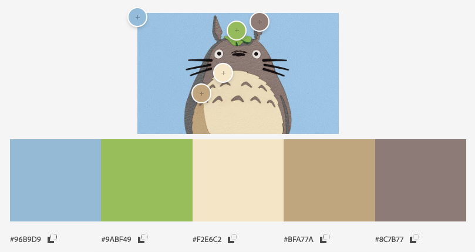
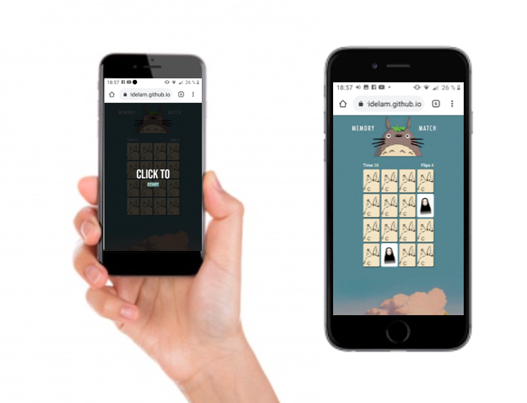

# Ghibli · Memory Match Game

## Índice

* [1. Tecnologías/Herramientas utilizadas](#1-tecnologías/herramientas-usadas)
* [2. Live Demo](#2-live-demo)
* [3. Preview](#3-preview)
* [4. Definición del producto](#4-definición-del-producto)
* [5. Historias de usuario/Features](#5-historias-de-usuario/features)
* [6. Prototipo](#6-prototipo)
* [7. Test de usabilidad](#7-test-de-usabilidad)

***

## 1. Tecnologías/Herramientas usadas

- HTML
- CSS
- JavaScript
- Github
 

## 2. Live Demo

Puedes probar el juego en https://valeriavidelam.github.io/SCL016-memory-match-game/src/index.html

## 3. Preview

 

## 4. Definición del producto

_**Ghibli Memory Match**_ es una versión web del clásico juego de memorice con una versión especial inspirada en las películas del estudio japonés de animación Ghibli. El proyecto está pensado como una página con interfaz rápida para proporcionar a un jugador una partida rápida mientras tiene un tiempo libre frente a su dispositivo. La finalidad de este producto es entregar unos minutos de distención y pausa necesaria durante a aquellos usuarios que tienen que trabajar frente a la pantalla y por A, B o C motivo tienen que esperar algo.

El _**público objetivo**_ pensado para este proyecto abarca personas entre **25 - 35 años**, conocedoras _en su mayoría_ sobre la temática del mundo Ghibli, que cuentan con un rato libre mientras están trabajando o haciendo algo frente a los dispositivos. Sin embargo, se considera un _público objetivo de rebote_ entre los 50 - 60 que sean asiduos a los juegos interactivos de fácil interpretación y que les guste pasar tiempo libre frente a sus dispositivos electrónicos.
Está pensando en inglés de manera de hacerlo más universal; de igual manera no maneja mucho texto por lo que no es imprescindible manejar el idioma por completo.

La modalidad de juego consta en iniciar la página, hacer click al botón **"Click to START"**, el que te llevará a una página donde aparecen 16 cartas y una música alusiva a alguna película de Ghibli te invita a jugar. El jugador deberá hacer click a cada carta hasta lograr hacer match en un tiempo establecido de 50 segundos.
Al ser un prototipo básico, el juego solo consta de una partida, sin niveles de dificultad ni incrementación o disminución de tiempo, ya que como bien se menciona al inicio, está pensado para ser un juego rápido de paso que puedes repetir cuantas veces quieras al día mientras esperas que cargue una página, o que te atiendan en algún lugar.

## 5. Historias de usuario

Se realizó una breve encuesta a personas que integraran el grupo etario clasificado como público objetivo, definiendo así las historias de usuario para dar inicio al prototipo y creación del proyecto.

### HU 1. "Como usuario quiero visualizar el juego de manera rápida desde cualquier dispositivo electrónico".
_FEATURES: User can view the game. / El usuario debe ser capaz de poder cargar y visualizar el juego en diferentes dispositivos._

* Solución: Crear un display de bienvenida con un botón que permita acceder al juego.
* Criterio mínimo de aceptación: Que al hacer click en el botón de comenzar la partida te lleve al display del juego. 
* Product Backlog:

        - Display con mensaje de bienvenida.
        - Colocar botón "Start" para iniciar el juego.
        - Dar funcionalidad al botón para que te lleve hasta el display de gameplay.
        - Añadir estilo a ambos display de acuerdo al diseño en Figma.
        - Diseñar en forma responsiva.

### HU 2. "Quiero jugar más de una partida sin que se repita el juego anterior".
_FEATURES: User can refresh the page and play again with random cards. / El usuario debe ser capaz de refrescar la página y jugar indefinidamente siempre con baraja nueva._

* Solución: Que al refrescar la página se active el algoritmo de Fisher-Yates y retorne al inicio del juego.
* Criterios mínimos de aceptación: Que cada vez que actualice la página se genere un nuevo orden de cartas.
* Product Backlog:

        - Crear un botón 'Play again' en la ventana de Victory o GameOver.
        - Crear función que active mecanismo de orden aleatorio y enlazar a través de un evento a los botones.
        

### HU3. "Necesito ir viendo si las cartas coinciden y hago match".
_FEATURES: User can select cards and view their flips. User cand match 2 cards. / El usuario puede ser capaz de seleccionar una carta y hacer match en caso de que coincidan. Las cartas se deben girar en caso contrario_

* Solución: Que al hacer click en dos cartas y ambas coincidan, se queden boca arriba hasta terminar el juego.
* Criterios mínimos de aceptación: Que pueda girar cartas de 2 en 2, que se queden boca arriba si coinciden.
* Product Backlog:

        - Crear la opción de transición de cartas en CSS.
        - Crear una función que active la transición al hacer click en las cartas.
        - Crear una función que permita ir rotando cartas de 2 en 2.
        - Crear una función que permita hacer match si ambas cartas coinciden.
        
### HU4. "Como buen competidor, quiero que el juego me indique si gané".
_FEATURES: User can win the game. User can lose the game / El jugador tiene que recibir un anuncio en que avise si ganó o perdió la partida._

* Solución: Display que muestre mensaje de Victoria cuando se haga match en todas las cartas. Así mismo, agregar display que avise que se acabó el tiempo en caso contrario.
* Criterios mínimos de aceptación: Que se muestre un mensaje de Victory o de Game Over.
* Product Backlog:

        - Crear display "Victory".
        - Crear display "Game Over".
        - Crear contador de Flips.
        - Crear contador de tiempo.
        - Crear una función que llame al display de Victory en caso de que estén todas las cartas boca arriba.
        - Crear una función que llame al display de Game Over en caso de que el contador de tiempo llegue a 0 sin las carta boca arriba.

### HU5. "Me gustaría escuchar alguna música de la película mientras juego, o en su defecto que tenga sonidos para que me entretenga más".
_FEATURES: User can listen ghibli's soundtrack while their play the game. / El usuario puede escuchar música de Ghibli mientras está jugando._ 

* Solución: Agregar un dispositivo que permita escuchar el soundtrack de Ghibli. Agregar efectos de sonido al tocar las cartas.
* Criterios mínimos de aceptación: Que se escuche música mientras se juega. 
* Product Backlog:

        - Crear una función que llame a activar música al iniciar la partida. Enlazar la función mediante un evento al botón de CLick to start.
        - Crear una función que active sonidos cada vez que el usuario hace match o hace girar las cartas. 
        - Crear una función que active un sonido de victoria si el jugador gana la partida.
        - Crear una función que active un sonido de game over en caso de que el jugador no logre completar las cartas.

## 6. Prototipo

### Diseño de baja fidelidad

Se diseñó un prototipo que cumpliera con las condiciones básicas pedidas por los usuarios, que sea interactivo y de fácil acceso. 
Para la creación de paleta de colores se identificó al personaje que sería parte del logo y a partir de esto se creó la primera propuesta.

### Diseño de alta fidelidad

Con la propuesta de color y el diseño más aterrizado, se creo una versión digital de alta fidelidad.

<a href="https://www.figma.com/proto/Xv0RGO1ZEFsL9VgDukciNR/Untitled?node-id=23%3A2&scaling=min-zoom&page-id=0%3A1" rel="nofollow">Click aquí para ver el prototipo completo.</a>

### Diseño final

        - Versión Desktop

 

        - Versión Móvil

 

## 7. Test de usabilidad

Bajo este testeo de usabilidad, se detectan una serie de errores a implementar para la mejora del producto final. Entre ellos se destaca:

        - Logo demasiado grande. Trabajar en CSS tamaño y adaptabilidad.
        - El responsive no está funcionando correctamente en todos los dispositivos. 
        - Se considera la posibilidad de poner instrucciones antes de iniciar el juego. 
