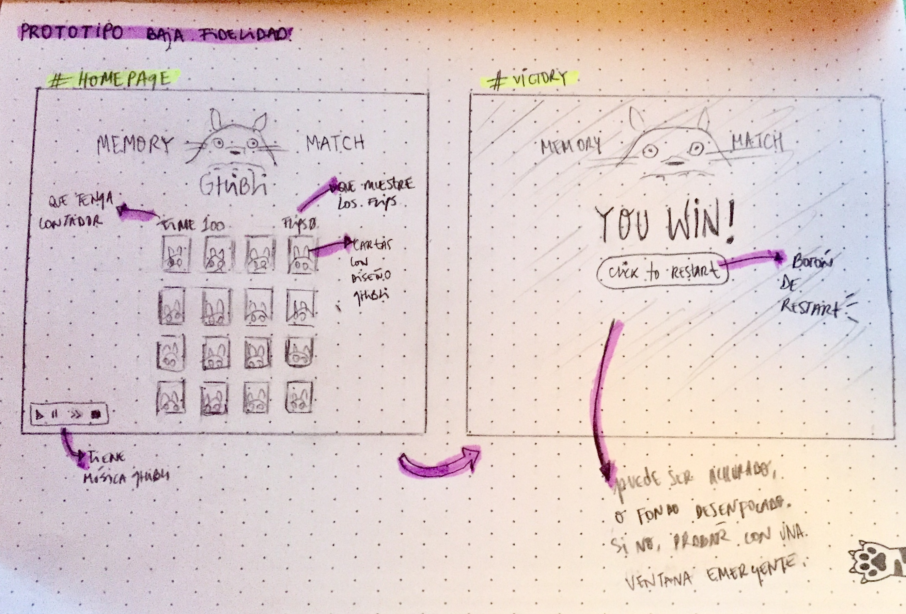
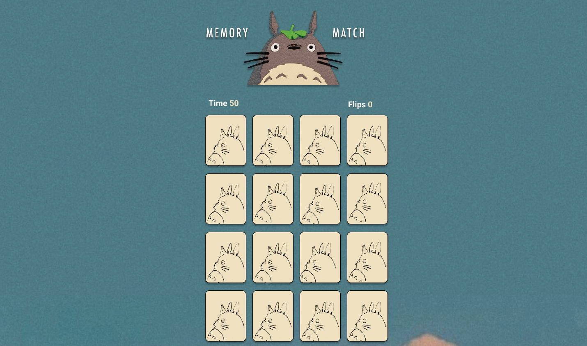
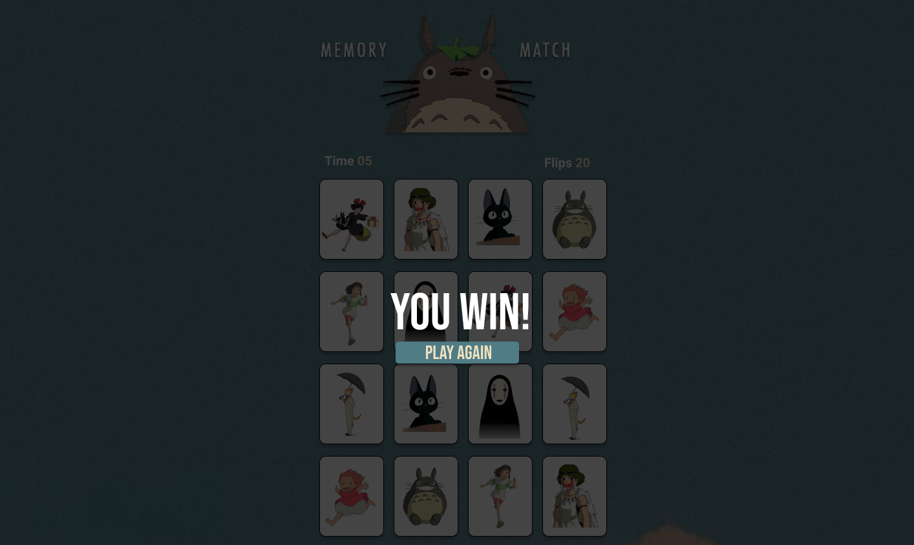
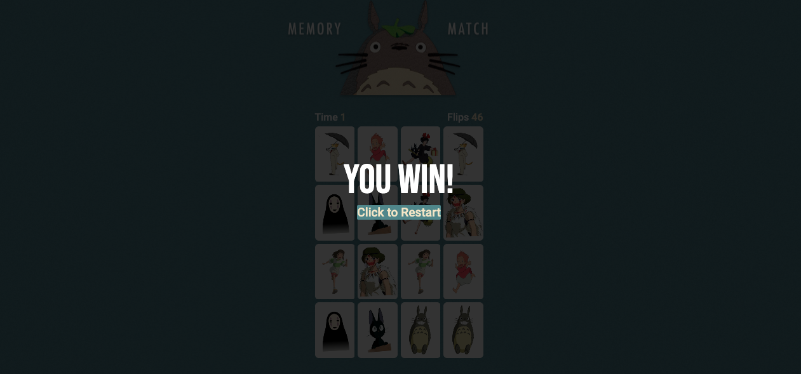
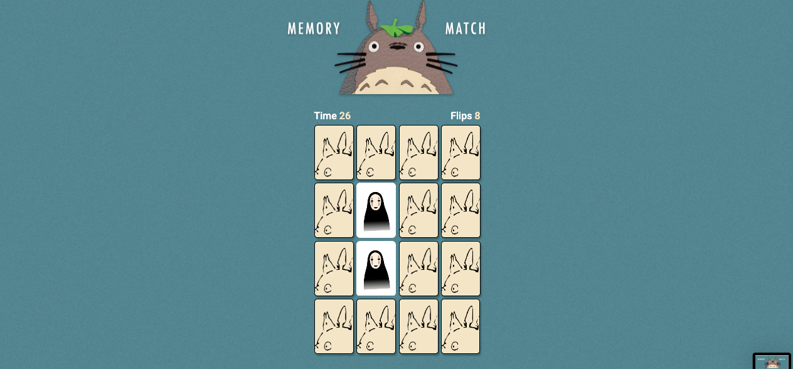
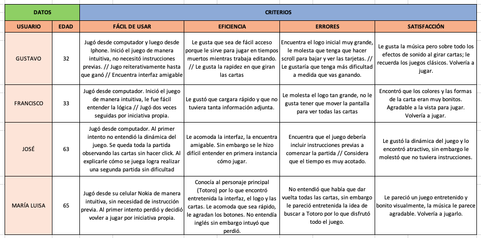

# Ghibli · Memory Match Game

## Índice

* [1. Tecnologías/Herramientas utilizadas](#1-tecnologías/herramientas-usadas)
* [2. Live Demo](#2-live-demo)
* [3. Preview](#3-preview)
* [4. Definición del producto](#4-definición-del-producto)
* [5. Historias de usuario/Features](#5-historias-de-usuario/features)
* [6. Prototipo](#6-prototipo)
* [7. Test de usabilidad](#7-test-de-usabilidad)

***

## 1. Tecnologías/Herramientas usadas

- HTML
- CSS
- Javascript
- Github
- Node.js 

## 2. Live Demo

Puedes probar el juego en https://valeriavidelam.github.io/SCL016-memory-match-game/src/index.html

## 3. Preview

 

## 4. Definición del producto

**Ghibli Memory Match** es una versión web del clásico juego de memorice con una versión especial inspirada en las películas del estudio japonés de animación Ghibli. El proyecto está pensado como una página con interfaz rápida para proporcionar a un jugador una partida rápida mientras tiene un tiempo libre frente a su dispositivo.

El **público objetivo** pensado para este proyecto abarca personas entre 25 - 35 años, conocedoras _en su mayoría_ sobre la temática del mundo Ghibli, que cuentan con un rato libre mientras están trabajando o haciendo algo frente a los dispositivos. Sin embargo, se considera un público objetivo de rebote entre los 50 - 60 que sean asiduos a los juegos interactivos de fácil interpretación y que les guste pasar tiempo libre frente a sus dispositivos electrónicos.
Está pensando en inglés de manera de hacerlo más universal; de igual manera no maneja mucho texto por lo que no es imprescindible manejar el idioma por completo.

La modalidad de juego consta en iniciar la página, hacer click al botón **"Click to start"**, el que te llevará a una página donde aparecen 16 cartas y una música alusiva a alguna película de Ghibli te invita a jugar. El jugador deberá hacer click a cada carta hasta lograr hacer match en un tiempo establecido de 50 segundos.
Al ser un prototipo inicial básico, el juego solo consta de una partida, sin niveles de dificultad ni incrementación o disminución de tiempo, ya que como bien se menciona al inicio, está pensado para ser un juego rápido de paso que puedes repetir cuantas veces quieras al día mientras esperas que cargue una página, o que te atiendan en algún lugar.

## 5. Historias de usuario/FEATURES

Se realizó una encuesta a personas que integraran el grupo etario clasificado como público objetivo, definiendo así las historias de usuario para dar inicio al prototipo y creación del proyecto.

#### HU 1. Como usuario quiero visualizar el juego de manera rápida desde cualquier plataforma o dispositivo electrónico.
FEATURES: User can view the game. / El usuario debe ser capaz de poder cargar y visualizar el juego en diferentes dispositivos.
- El prototipo de fidelidad debe ser amigable con todos los usarios y debe priorizar un juego ágil y rápido.
- Debe tener una página de inicio con un index básico en HTML que me lleve al juego.
- Debe ser responsive para que se adapte a cualquier dispositivo electrónico.

#### HU 2. Como usuario quiero poder jugar más de una partida sin repetir.
FEATURES: User can refresh the page and play again with random cards. / El usuario debe ser capaz de refrescar la página y jugar indefinidamente siempre con baraja nueva.
- Las cartas tienen que barajarse cada vez que abra la página
- Darle una opción de 'play again' cada vez que gane o pierda el juego.

#### HU3. Como jugador quiero ir viendo hago match y voy ganando cartas.
FEATURES: User can select cards and view their flips. User cand match 2 cards. / El usuario puede ser capaz de seleccionar una carta y hacer match en caso de que coincidan. Las cartas se deben girar en caso contrario. 
- Hacer flipcard con todas las cartas.
- Hacer una función que llame a dos cartas iguales a quedarse congeladas y hacer match. En caso contrario, deben volver a girarse y quedar boca abajo.

#### HU4. Como jugador empedernido quiero que el juego me indique si gané o perdí la partida.
FEATURES: User can win the game. User can lose the game / El jugador tiene que recibir un anuncio en que avise si ganó o perdió la partida.
- Crear un alert o un div que contenga un mensaje que diga que ganó o perdió el juego. Otorgarle la función en caso de que haga match con todas las cartas o en caso contrario.

#### HU5. Como usuario quiero escuchar una música relajante mientras estoy jugando o de lo contrario que tenga sonidos que me motiven a jugar entretenido.

FEATURES: User can listen ghibli's soundtrack while their play the game. / El usuario puede escuchar música de Ghibli mientras está jugando. 
- Crear una función que llame a activar música al iniciar la partida.
- Crear una función que active sonidos cada vez que el usuario hace match o hace girar las cartas.
- Crear una función que active un sonido de victoria si el jugador gana la partida.
- Crear una función que active un sonido de game over en caso de que el jugador no logre completar las cartas.

## 6. Prototipo

### Diseño de baja fidelidad

### Diseño de alta fidelidad

<a href="https://www.figma.com/proto/Xv0RGO1ZEFsL9VgDukciNR/Untitled?node-id=23%3A2&scaling=min-zoom&page-id=0%3A1" rel="nofollow">Click aquí para ver el prototipo completo.</a>

### Diseño final

- Versión Desktop
 

- Versión Móvil

 

## 7. Test de usabilidad

